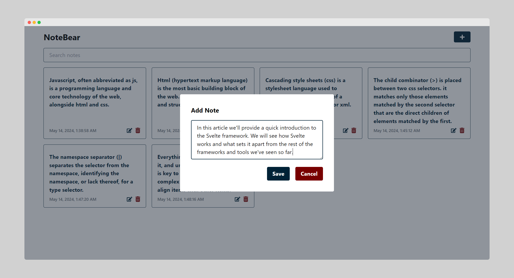
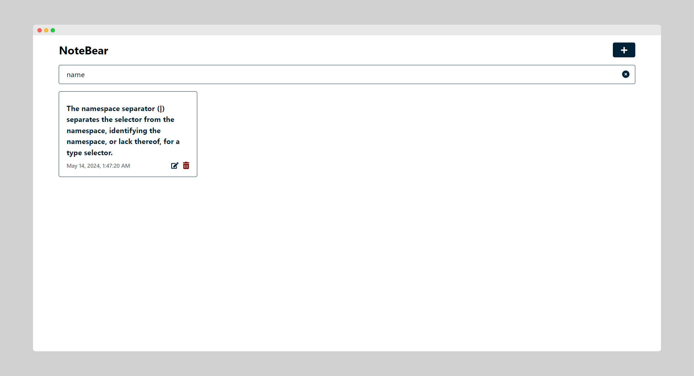
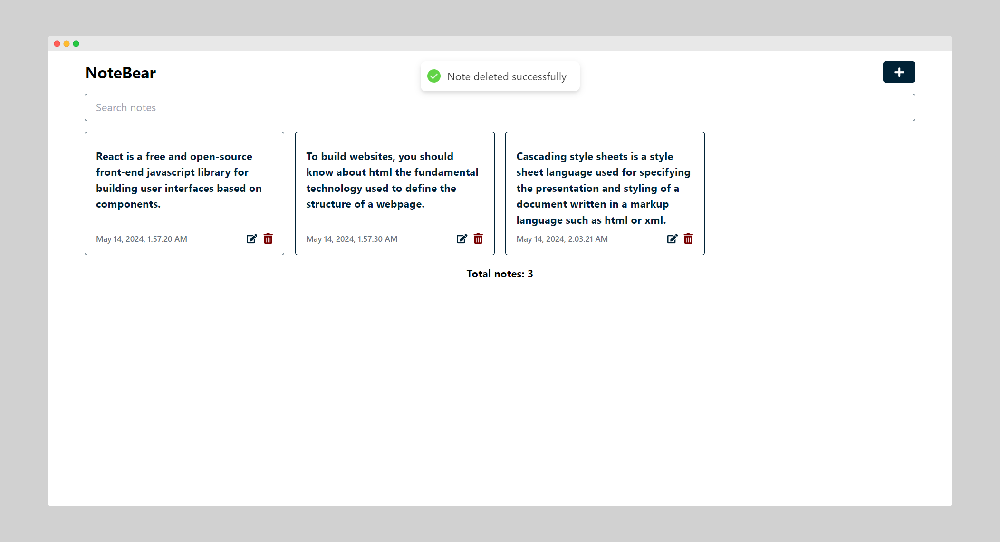

# React Notes App Assignment

This documentation provides an overview of the structure, functionality, and usage of the React Notes App.

## Table of Contents

1. [Introduction](#introduction)
2. [Components](#components)
   - [Header](#header-component)
   - [Modal](#modal-component)
   - [Note](#note-component)
   - [NotesList](#noteslist-component)
   - [SearchBar](#searchbar-component)
3. [Hooks](#hooks)
   - [useNotes](#usenotes-hook)
4. [Functionalities](#functionalities)

   - [Adding Notes](#adding-notes)
   - [Editing Notes](#editing-notes)
   - [Searching Notes](#searching-notes)
   - [Deleting Notes](#deleting-notes)
   - [Local Storage](#local-storage)

5. [Installation](#installation)
6. [Development](#development)

## Introduction <a name="introduction"></a>

The React Notes App is a simple note-taking application built using React. It allows users to create, edit, delete, and search notes.

## Components <a name="components"></a>

](src/assets/img1.png)

### Header Component <a name="header-component"></a>

The Header component displays the title of the application and provides a button to add new notes.

### Modal Component <a name="modal-component"></a>

The Modal component is used for creating and editing notes. It includes input fields for the note title and content, along with buttons to save or cancel the operation.

### Note Component <a name="note-component"></a>

The Note component represents an individual note. It displays the note content, creation date, and provides options to edit or delete the note.

### NotesList Component <a name="noteslist-component"></a>

The NotesList component renders a grid of notes. It takes an array of notes as input and maps over them to render individual Note components.

### SearchBar Component <a name="searchbar-component"></a>

The SearchBar component allows users to search for notes by typing in a search query. It includes an input field for entering search text and a button to clear the search.

## Hooks <a name="hooks"></a>

### useNotes Hook <a name="usenotes-hook"></a>

The useNotes hook manages the state and logic for managing notes in the application. It provides functions for adding, editing, deleting, and searching notes, along with state variables to track input values, modal visibility, and editing state.

## Functionalities <a name="functionalities"></a>

### Adding Notes <a name="adding-notes"></a>



Users can add new notes by clicking the "Add Note" button in the Header component. This opens a modal where users can enter the title and content of the note. Upon saving, the note is added to the list of notes.

### Editing Notes <a name="editing-notes"></a>


To edit a note, users can click the edit button (pencil icon) displayed on each note. This opens the modal with the selected note's content pre-filled. Users can then modify the content and save the changes.

### Searching Notes <a name="searching-notes"></a>



The SearchBar component allows users to search for notes by typing in a search query. As the user types, the NotesList component filters the list of notes to display only those that match the search query.

### Deleting Notes <a name="deleting-notes"></a>


Users can delete a note by clicking the delete button (trash can icon) displayed on each note. This removes the note from the list of notes.

### Local Storage <a name="local-storage"></a>

The React Notes App utilizes local storage to persist notes data between sessions. When notes are added, edited, or deleted, the changes are reflected in the local storage. Upon refreshing the page or revisiting the application, the notes are retrieved from local storage, ensuring continuity of data.

## Installation <a name="installation"></a>

To install the React Notes App, run the following command:

```
npm install
```

This will install all the required dependencies.

## Development <a name="development"></a>

To run the React Notes App in development mode, execute the following command:

```
npm run dev
```

This will start the development server, and you can access the application at [http://localhost:5173](http://localhost:5173).
